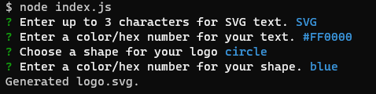
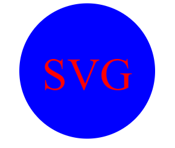
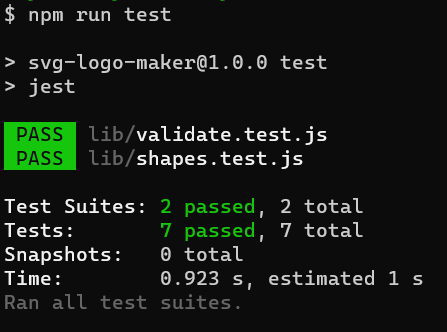

# svg-logo-maker
A command-line application that generates an SVG logo based on user input.

## User Story
AS a freelance web developer  
I WANT to generate a simple logo for my projects  
SO THAT I don't have to pay a graphic designer

## Acceptance Criteria
GIVEN a command-line application that accepts user input  
WHEN I am prompted for text  
THEN I can enter up to three characters  
WHEN I am prompted for the text color  
THEN I can enter a color keyword (OR a hexadecimal number)  
WHEN I am prompted for a shape  
THEN I am presented with a list of shapes to choose from: circle, triangle, and square  
WHEN I am prompted for the shape's color  
THEN I can enter a color keyword (OR a hexadecimal number)  
WHEN I have entered input for all the prompts  
THEN an SVG file is created named `logo.svg`  
AND the output text "Generated logo.svg" is printed in the command line  
WHEN I open the `logo.svg` file in a browser  
THEN I am shown a 300x200 pixel image that matches the criteria I entered

## Description of Work Performed
* Imported Inquirer package to allow user interface with terminal
  * Wrote questions for users to answer in the command-line application
  * Included Inquirer validation checking to validate user inputs
* Imported Jest package for test validation
  * There are two testing suites, one for validating user inputs and one for validating shape generation
  * Tests check for blank entries, SVG text longer than 3 characters, and appropriate shape fill color
* Answers to command-line questions are passed into a JavaScript function to generate an SVG file
  * User-entered text is used as the SVG text
  * User-entered color is used as the SVG text color
  * User-selected shape is used as the SVG output shape
  * User-entered color is used as the SVG shape color
* Sample output is saved in the examples folder

## Link to walkthrough tutorial
[SVG Logo Maker Walkthrough](https://drive.google.com/file/d/1J1SiNfNuwHeCyqr6tUaChFOurwLVETRV/view?usp=sharing)

## Screenshots

## License
This project is licensed under the MIT License - see the LICENSE.md file for details.

# Resources
- Node packages: [Inquirer](https://www.npmjs.com/package/inquirer)
- License badges: [Markdown License Badges Repo](https://gist.github.com/lukas-h/2a5d00690736b4c3a7ba)